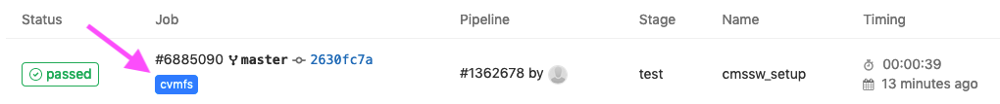

Before getting into details, a few links to useful documentation on GitLab
CI/CD and also CERN-specific information:

- [GitLab CI/CD documentation][gitlab-ci]
- [CERN Knowledge Base Articles for the Git Service][snow-git]

These pages serve as a good entrypoint in case of problems and questions.

## Choosing the correct GitLab runner

Standard GitLab runners at CERN do not mount CVMFS, which is required for
setting up CMSSW. In order to get a runner that mounts CVMFS, all you need
to do is add a `tag` to your `gitlab-ci.yml` file:

~~~
tags:
  - cvmfs
~~~
{: .language-yaml}

A minimal `.gitlab-ci.yml` file to get a runner with CVMFS looks like the following:

~~~
cmssw_setup:
  tags:
    - cvmfs
  script:
    - ls /cvmfs/cms.cern.ch/
~~~
{: .language-yaml}

The `cmssw_setup` line defines the name of the job, and all the job does is
list `/cvmfs/cms.cern.ch/`, which would fail if CVMFS isn't mounted. In the
GitLab UI one can see the output, and also the `cvmfs` label:

## Setting up CMSSW

> ## CMS-specific setup
> Since the runner doesn't run as your own user, it doesn't have any
> CMS-related environment as people registered as CMS members (via the _zh_
> group on LXPLUS). This means that everything needs to be set up manually.
{: .callout}

To set up a CMSSW release (here `CMSSW_10_6_8_patch1`), you would usually
run the following commands:

~~~
source /cvmfs/cms.cern.ch/cmsset_default.sh
cmsrel CMSSW_10_6_8_patch1
cd CMSSW_10_6_8_patch1/src
cmsenv
~~~
{: .language-bash}

Maybe the second command will print out a warning such as

~~~
WARNING: Developer's area is created for non-production architecture slc7_amd64_gcc820. Production architecture for this release is slc7_amd64_gcc700.
~~~
{: .output}

which can be ignored in this case (or could be removed by first executing
`export SCRAM_ARCH=slc7_amd64_gcc700`).

The command `source /cvmfs/cms.cern.ch/cmsset_default.sh` sets several
environment variables, in particular adding `/cvmfs/cms.cern.ch/common` to
the `${PATH}`. You can check this by running `echo ${PATH}`. Another effect
of this command is that several aliases are defined, which means that
executing the alias command effectively executes the original command. The
most important aliases are in the table below:

|-------------+---------------------------------|
| Alias       | Command                         |
|-------------+---------------------------------|
| `cmsenv`    | ``eval `scramv1 runtime -sh` `` |
| `cmsrel`    | `scramv1 project CMSSW`         |
|-------------+---------------------------------|

Knowing that a command is an alias is important, since `bash` does not
automatically expand aliases when running non-interactively, which is the
case when running in GitLab.

> ## Printing all set aliases
> To print all aliases that are set, just run `alias`.
{: .callout}

In order to make aliases work in the GitLab runners, one needs to explicitely
enable alias expansion:

~~~
shopt -s expand_aliases
~~~
{: .language-bash}

Another common pitfall when setting up CMSSW in GitLab is that the execution
fails because the setup script doesn't follow best practives for shell
scripts such as returning non-zero return values even if the setup is OK or
using unset variables. Even if the script exits without visible error message,
there could be something wrong. It is therefore often a good idea to
circumvent issues like that by disabling strict checks before running the
setup command and enabling these checks afterwards again.

> ## Exercise: Set up CMSSW in GitLab
> Knowing all this, can you write the yaml to set up CMSSW in GitLab starting from the fragment above and check if this is all working by executing `cmsRun --help` at the end?
{: .challenge}

> ## Solution: Set up CMSSW in GitLab
> Here is a possible solution:
>
> ~~~
> cmssw_setup:
>   tags:
>     - cvmfs
>   variables:
>     # This is also set on LXPLUS
>     CMS_PATH: /cvmfs/cms.cern.ch
>   script:
>     # IMPORTANT: Expand aliases in noninteractive bash mode
>     # Otherwise cmsrel and cmsenv won't work
>     - shopt -s expand_aliases
>     # access CVMFS
>     - set +u && source ${CMS_PATH}/cmsset_default.sh; set -u
>     - cmsrel CMSSW_10_6_8_patch1
>     - cd CMSSW_10_6_8_patch1/src
>     - cmsenv
>     - cmsRun --help
> ~~~
> {: .language-yaml}
>
> The `set +u` command turns off errors for referencing unset variables. It isn't really needed here, since `-u` (i.e. not allowing to use unset variables) isn't set by default, but the script would fail if one `set -u` somewhere else, so it's safer to catch this here.
{: .solution}

You can see some examples in the [payload GitLab repository][payload-gitlab-cms] for this lesson.


