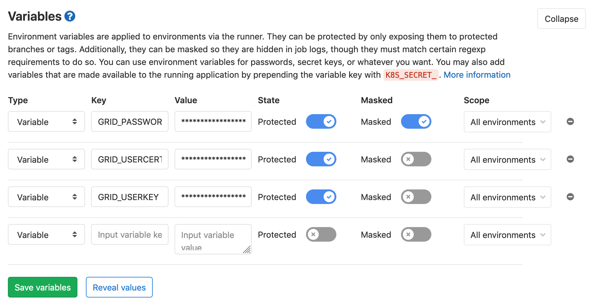
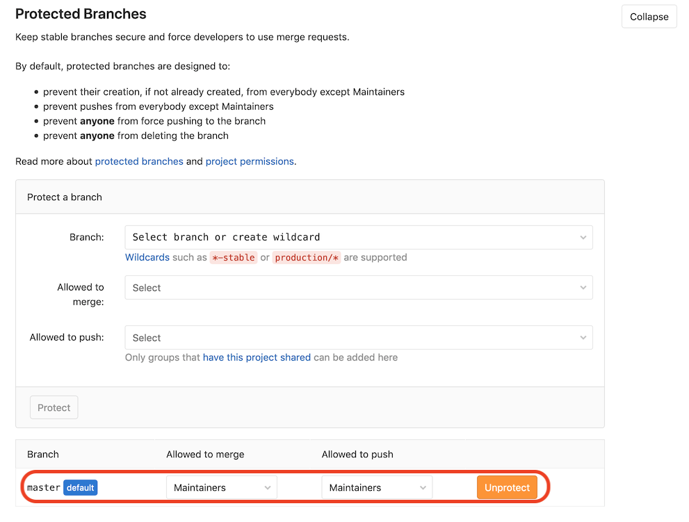

## Securely adding passwords and files to GitLab

When trying to access CMS data, a grid, or often also referred to as Virtual
Organization Membership Service (VOMS) proxy is needed in most cases. In
order to be able to obtain this proxy, your `userkey.pem` and `usercert.pem`
files, which by default will reside in the `~/.globus` directory, will need
to be stored in GitLab.

> ## Keep your secrets secret!
> Please be extra careful when it comes to your account and grid passwords as
> well as your certificates! They should never be put in any public place.
> Putting them under version control is risky, since even if you delete them
> from the `HEAD` of your `master` branch, they will still be in the commit
> history.
{: .callout}

Please make sure to revisit the section on
[private information/access control][lesson-gitlab-secrets]
from the
[Continuous Integration / Continuous Development (CI/CD)][lesson-gitlab]
on how to add variables in GitLab CI/CD in general. From that lesson you will
know how to add e.g. your grid proxy password. The grid certificate itself,
however, consists of two files that look like this:

~~~
cat ~/.globus/usercert.pem
~~~
{: .language-bash}

~~~
Bag Attributes
    localKeyID: 95 A0 95 B0 1e AB BD 13 59 D1 D2 BB 35 5A EA 2E CD 47 BA F7
subject=/DC=ch/DC=cern/OU=Organic Units/OU=Users/CN=username/CN=123456/CN=Anonymous Nonamious
issuer=/DC=ch/DC=cern/CN=CERN Grid Certification Authority
-----BEGIN CERTIFICATE-----
TH1s1SNT4R34lGr1DC3rt1f1C4t3But1Th4s4l3NgtH0F64CH4r4ct3rSP3rL1N3
1amT00La2YT0wR1T345m0r3l1N3S0fn0ns3NS3S01/lLSt0pH3r3AndADdsPAc3S
...45 more lines of l33t dialect...
+4nd+heL4S+38cH4r4c+ersBef0rE+HE1+enDs==
-----END CERTIFICATE-----
~~~
{: .output}

### We need more base: `base64`

Simply pasting them into GitLab does not work since the line breaks will not
be reflected correctly. There is a trick we can play though: we can encode the
files including line breaks so that they are simply a string, which we can
decode to yield the same result as the input. The tool of our choice is
`base64`. Let's give this a go.

> ## Exercise: Encode using `base64`
>
> Copy the output of the `cat ~/.globus/usercert.pem` output above into a
> text file called `testcert.txt`, and pipe the content of this file to the
> `base64` command or use it as input file directly (hint: `base64 --help`).
>
{: .challenge}

> ## Solution: Encode using `base64`
> The command should be (when piping):
> ~~~
> cat testcert.txt | base64
> ~~~
> {: .language-bash}
>
> or (when using the input file directly - this is better):
>
> ~~~
> base64 -i testcert.txt
> ~~~
> {: .language-bash}
>
> and the output will then be the following:
>
> ~~~
> QmFnIEF0dHJpYnV0ZXMKICAgIGxvY2FsS2V5SUQ6IDk1IEEwIDk1IEIwIDFlIEFCIEJEIDEzIDU5IEQxIEQyIEJCIDM1IDVBIEVBIDJFIENEIDQ3IEJBIEY3CnN1YmplY3Q9L0RDPWNoL0RDPWNlcm4vT1U9T3JnYW5pYyBVbml0cy9PVT1Vc2Vycy9DTj11c2VybmFtZS9DTj0xMjM0NTYvQ049QW5vbnltb3VzIE5vbmFtaW91cwppc3N1ZXI9L0RDPWNoL0RDPWNlcm4vQ049Q0VSTiBHcmlkIENlcnRpZmljYXRpb24gQXV0aG9yaXR5Ci0tLS0tQkVHSU4gQ0VSVElGSUNBVEUtLS0tLQpUSDFzMVNOVDRSMzRsR3IxREMzcnQxZjFDNHQzQnV0MVRoNHM0bDNOZ3RIMEY2NENINHI0Y3QzclNQM3JMMU4zCjFhbVQwMExhMllUMHdSMVQzNDVtMHIzbDFOM1MwZm4wbnMzTlMzUzAxL2xMU3QwcEgzcjNBbmRBRGRzUEFjM1MKLi4uNDUgbW9yZSBsaW5lcyBvZiBsMzN0IGRpYWxlY3QuLi4KKzRuZCtoZUw0UyszOGNINHI0YytlcnNCZWYwckUrSEUxK2VuRHM9PQotLS0tLUVORCBDRVJUSUZJQ0FURS0tLS0tCg==
> ~~~
> {: .output}
{: .solution}

Decoding works by adding the `-d` (Linux) or `-D` (MacOS) flag to the
`base64` command. You can verify that this works by directly decoding again
as follows:

~~~
base64 -i testcert.txt | base64 -d
~~~
{: .language-bash}

which should give you the pseudo-certificate from above. Have a go at
the exercise below and try to decode the secret phrase:

> ## Exercise: Decode using `base64`
>
> Decode the following string using the `base64` command:
> `SSB3aWxsIG5ldmVyIHB1dCBteSBzZWNyZXRzIHVuZGVyIHZlcnNpb24gY29udHJvbAo=`
>
{: .challenge}

> ## Solution: Decode using `base64`
> The command should be (mind the capitalisation of the `-D`/`-d` flag):
> ~~~
> echo "SSB3aWxsIG5ldmVyIHB1dCBteSBzZWNyZXRzIHVuZGVyIHZlcnNpb24gY29udHJvbAo=" | base64 -D
> ~~~
> {: .language-bash}
>
> and the output should be the following:
>
> ~~~
> I will never put my secrets under version control
> ~~~
> {: .output}
{: .solution}

## Adding grid certificate and password to GitLab

There are a couple of important things to keep in mind when adding passwords
and certificates as variables to GitLab:

- Variables should always be set to `Protected` state.
- As an additional safety measure, set them as `Masked` as well if possible (this will not work for the certificates but should for your grid password).

For more details, see the
[Variables: Advanced use section][gitlab-variables-advanced]
of the GitLab documentation. Setting variables to `Protected` means that
they are only available in protected branches, e.g. your `master` branch.
This is important when collaborating with others, since anyone with access
could just `echo` the variables when making a merge request if you run
automated tests on merge requests.

We will add the following three variables:

- `GRID_PASSWORD`: password for the grid certificate
- `GRID_USERCERT`: grid user certificate (`usercert.pem`)
- `GRID_USERKEY`: grid user key (`userkey.pem`)

For safety and to avoid issues with special characters, you should not
simply add your grid proxy password in GitLab,
but always encode it using `base64`.
For your password do the following
(**make sure nobody's peeking at your screen**):

~~~
printf 'mySecr3tP4$$w0rd' | base64
~~~
{: .language-bash}

Mind the single quotes (`'`) and not double quotes (`"`).
For the two certificates, use them as input to `base64` directly:

~~~
base64 -i ~/.globus/usercert.pem
base64 -i cat ~/.globus/userkey.pem
~~~
{: .language-bash}

and copy the output into GitLab.

> ## Every equal sign counts!
> Make sure to copy the full string including the trailing equal signs.
{: .callout}

The `Settings` --> `CI / CD` --> `Variables` section should look like this:

> ## Better safe than sorry
> To reduce the risk of leaking your passwords and certificates to others, you should
> **protect** your master branch, effectively preventing you and others from pushing to
> it directly and e.g. print your password to the job logs.
> To do so, go to *Settings* -> *Repository* -> *Protected Branches*. Mind that the
> option chosen below still puts a lot of trust in your collaborators. With the
> **Protected** option chosen above for the variables, the variables are then only
> available to those branches (but still allow Maintainers to push to them):
>
> 
{: .callout}

## Using the grid proxy to query DAS

With the grid secrets stored, we can now make use of them. We need to first
restore the grid certificate files in the `~/.globus` directly, then run the
`voms-proxy` command and pass the grid proxy password to it. This is done as
follows:

~~~
mkdir -p ${HOME}/.globus
printf "${GRID_USERCERT}" | base64 -d > ${HOME}/.globus/usercert.pem
printf "${GRID_USERKEY}" | base64 -d > ${HOME}/.globus/userkey.pem
chmod 400 ${HOME}/.globus/userkey.pem
printf "${GRID_PASSWORD}" | base64 -d | voms-proxy-init --voms cms --pwstdin
~~~
{: .language-bash}

Trying this with the standard GitLab CC7 runner will fail, since the
CMS-specific certificates are not included in the image. An image that
has these certificates installed already is
`gitlab-registry.cern.ch/clange/cmssw-docker/cc7-cms:latest`.
An example to obtain a grid proxy, check it, and then destroy it again
would result in the following `yaml`:

~~~
voms_proxy:
  image:
    name: gitlab-registry.cern.ch/clange/cmssw-docker/cc7-cms:latest
    entrypoint: [""]
  script:
    - mkdir -p ${HOME}/.globus
    - printf "${GRID_USERCERT}" | base64 -d > ${HOME}/.globus/usercert.pem
    - printf "${GRID_USERKEY}" | base64 -d > ${HOME}/.globus/userkey.pem
    - chmod 400 ${HOME}/.globus/userkey.pem
    - printf "${GRID_PASSWORD}" | base64 -d | voms-proxy-init --voms cms --pwstdin
    - voms-proxy-info --all
    - voms-proxy-destroy
~~~
{: .language-yaml}

Confirm that this works for you before moving on to the next section!
In case of problems, you might need to add `-w 0` to the `base64 -d`
command (to be confirmed).


